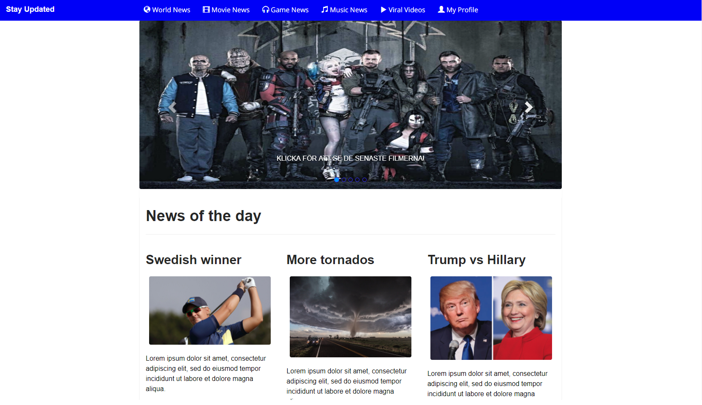
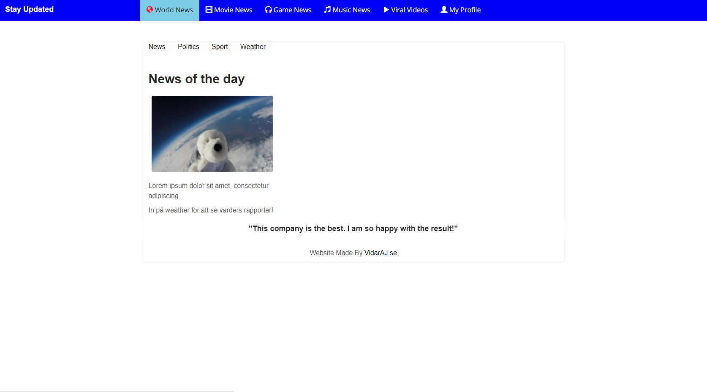
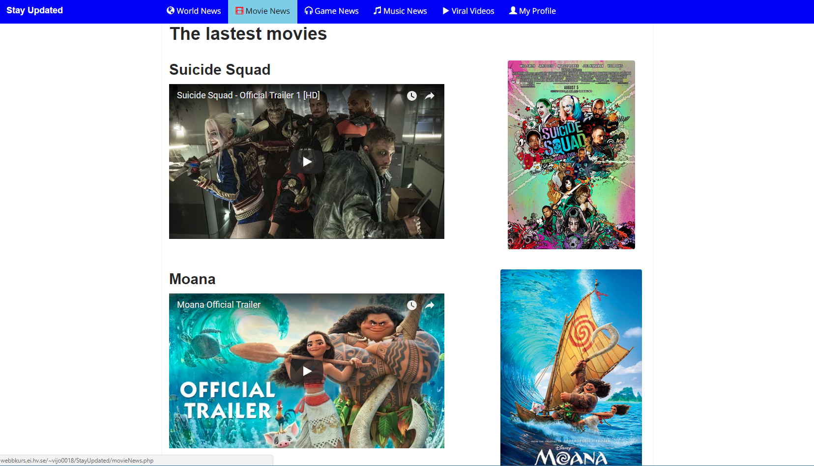
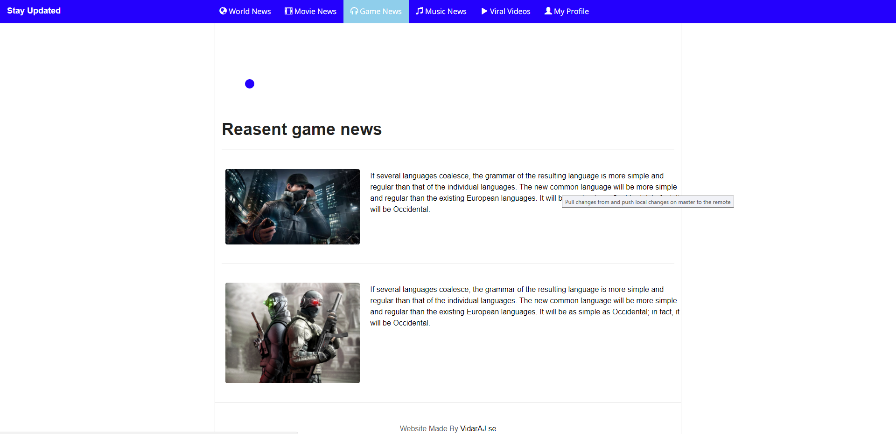
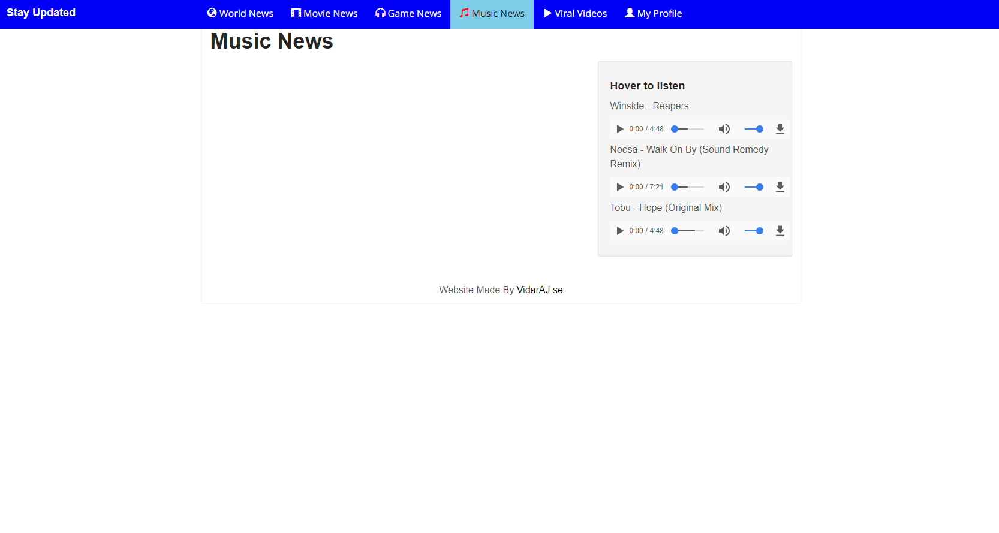
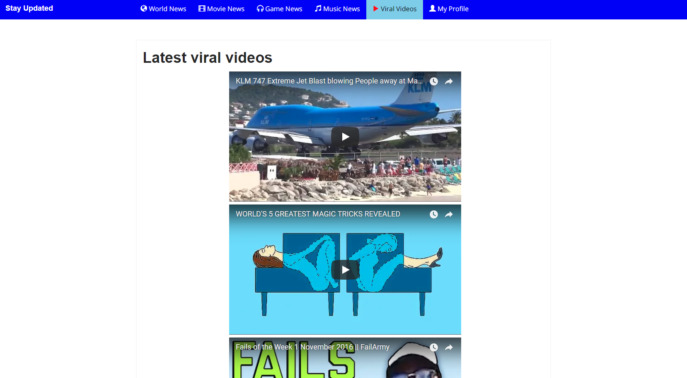
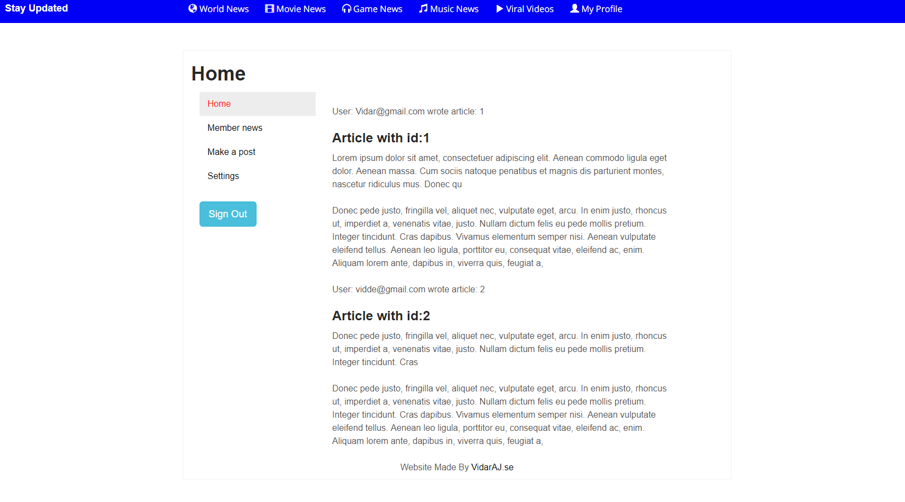
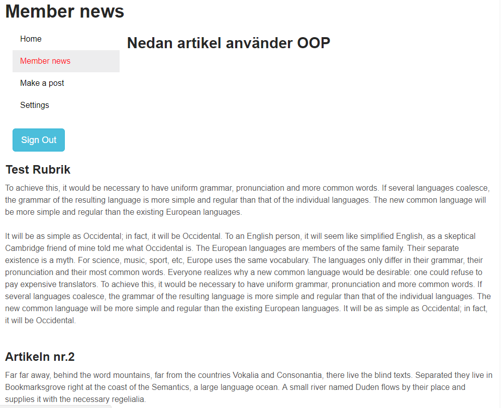
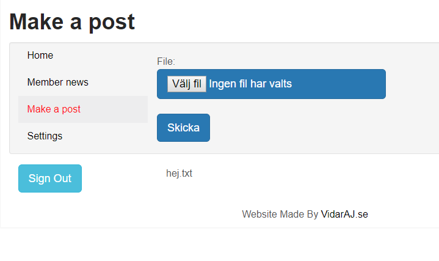
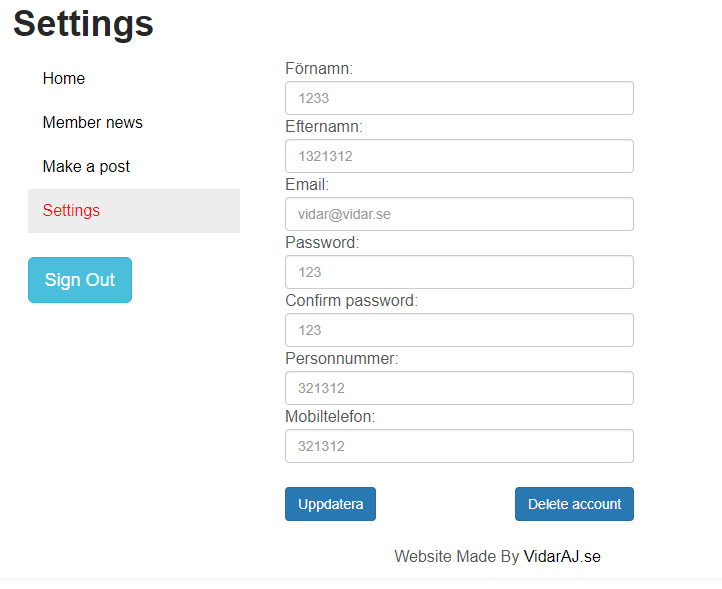

# StayUpdated
Year 2 project
News Website created in two different plattform (PHP and ASP.NET)
Responsive for all types of devices.

With login and advance functions in PHP and ASP.NET
(This was mainly a project to see how both languages differ)

